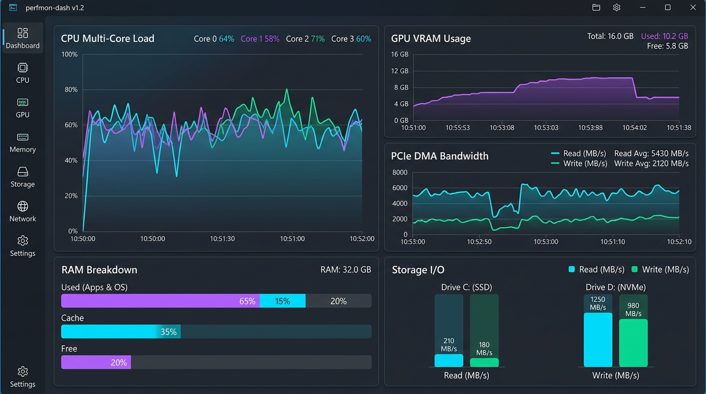
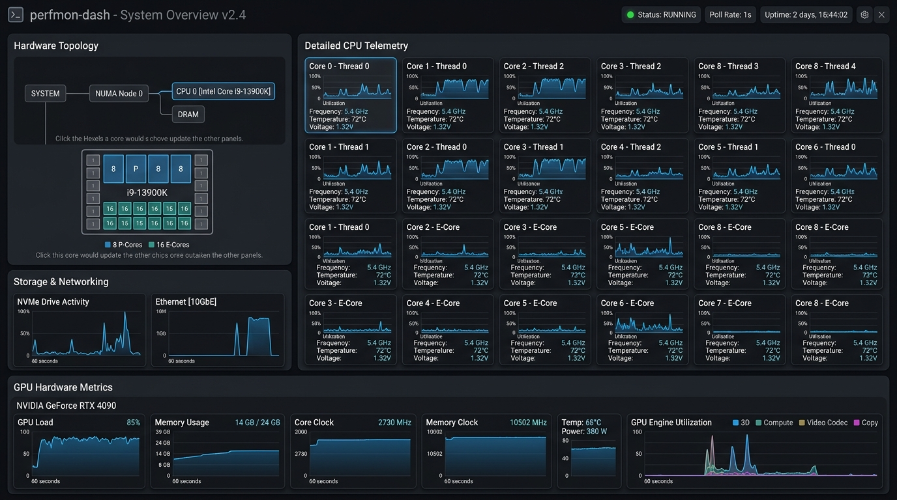

# ⚡ perfmon-dash

> **Native Windows System Performance Telemetry Dashboard**  
> Built with Rust, `eframe`/`egui`, and direct Windows NT Kernel API integration.



---

## 🌟 Overview

**perfmon-dash** is a light-weight, high-refresh-rate native Windows desktop telemetry application. It bypasses heavy WMI wrappers by communicating directly with **Windows NT Kernel APIs** (`NtQuerySystemInformation`) and the **Performance Data Helper (PDH) API** to monitor system CPU, GPU, VRAM, RAM, Disks, and Network performance with near-zero CPU overhead.

---

## 📸 Screenshots

| 📊 Main Telemetry Dashboard | 🖥️ Hardware Topology & Per-Core Telemetry |
| :---: | :---: |
|  |  |

---

## ✨ Features

* **🚀 Direct NT Kernel & PDH Telemetry**: Ultra-fast, zero-overhead polling of Windows system timers, thread interrupts, and performance counters.
* **🖥️ Per-Core CPU Monitoring**: Multi-core and thread utilization tracking with real-time graphs.
* **🎮 GPU Engine & VRAM Breakdown**: Hardware-level monitoring for GPU Load, VRAM allocation, Compute engine load, Video Decode, and PCIe DMA Copy throughput.
* **⚡ Memory & Storage I/O**: Real-time physical RAM cache vs. active process memory allocation and NVMe/SSD read/write speeds.
* **🌐 Network Bandwidth Telemetry**: Live network interface upload and download metrics.
* **🎨 Dark Glass UI & Embedded Icon**: Sleek modern aesthetic built on `eframe`/`egui` with native embedded Windows icon resources.
* **📦 Single Portable Executable**: Standalone binary with zero external installer or runtime dependencies.

---

## 📥 Download Pre-built Release Binary

You can download the compiled 64-bit Windows executable directly:

* 💾 **Direct Repository Download**: [`bin/perfmon-dash.exe`](bin/perfmon-dash.exe)
* 🚀 **GitHub Releases**: [Latest Release v1.0.0](https://github.com/ssrtist/perfmon-dash/releases)

---

## 🛠️ Building from Source

### Prerequisites
* **Windows 10 / 11** (x64)
* **Rust Toolchain** (1.75 or newer)

```bash
# Clone the repository
git clone https://github.com/ssrtist/perfmon-dash.git
cd perfmon-dash

# Build in Release Mode with optimizations
cargo build --release
```

The compiled binary will be generated at:  
`target/release/perfmon-dash.exe`

---

## 💻 Tech Stack

* **Language**: [Rust](https://www.rust-lang.org/)
* **GUI Framework**: [eframe](https://github.com/emilk/egui/tree/master/crates/eframe) & [egui](https://github.com/emilk/egui)
* **Plots & Charts**: [egui_plot](https://github.com/emilk/egui/tree/master/crates/egui_plot)
* **System Metrics**: Direct Win32 / NT Kernel API calls + [sysinfo](https://github.com/GuillaumeGomez/sysinfo)
* **Windows Resources**: `winres`

---

## 📜 License

Distributed under the MIT License. See `LICENSE` for more information.
